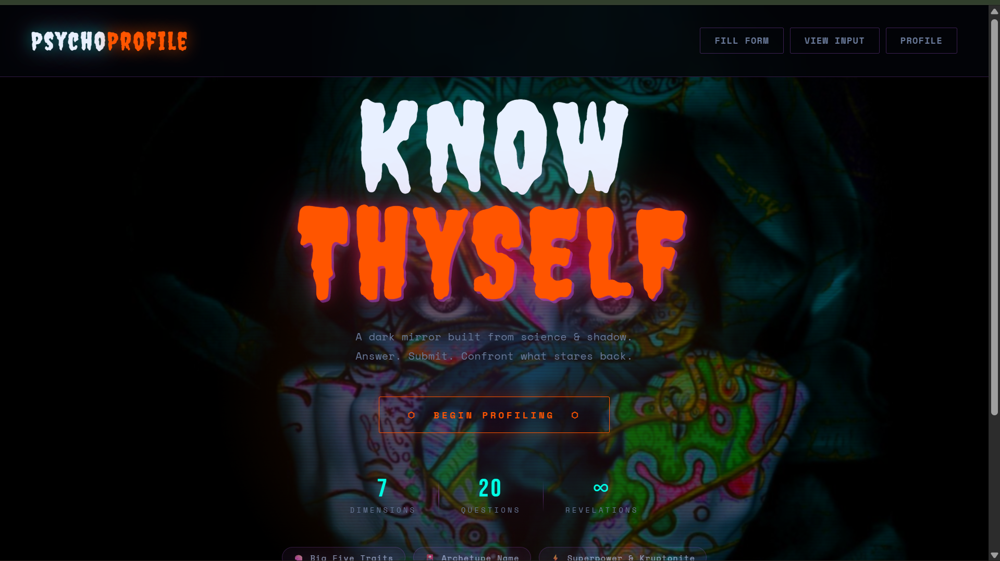
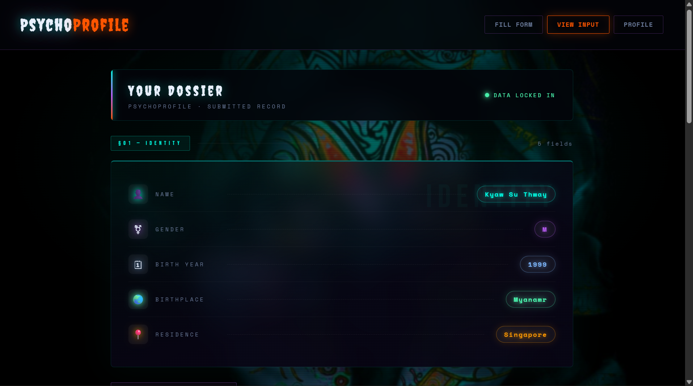
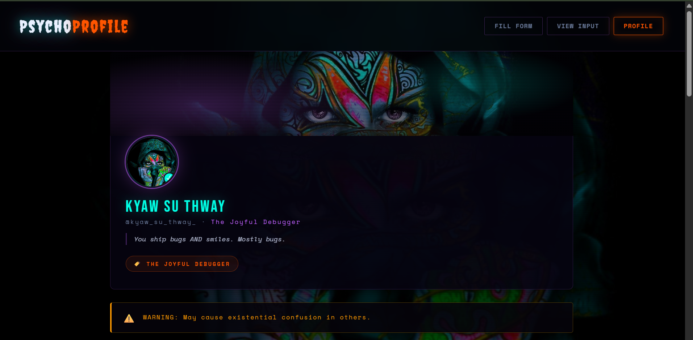

# 🧠 PsychoProfile — AI Personality Analyzer

Demo live link: https://psycho-profile.onrender.com/

> *A hilariously dramatic AI-powered psychological profiler built with FastAPI, Groq LLM, and a dark psychedelic UI.*

Users fill out a 3-step form, answer 10 Big Five personality questions, and receive a full psychological dossier — complete with a career match, archetype code name, villain origin story, soul city, spirit animal photos, and AI-recommended movies.

---

## 📁 Project Structure

```
psychoprofile/
├── main.py              # FastAPI backend — all routes and AI logic
├── index.html           # Shell page: nav, layout, toast, background
├── psycho.html          # Multi-step form (injected via /form route)
├── static/
│   ├── script.js        # All frontend JS: wizard, viewInput, analyze, profile
│   ├── favicon.ico
│   ├── images/          # Background + career/cover images
│   │   ├── psycho.jpg
│   │   ├── developer.jpg
│   │   ├── desinger.jpg
│   │   ├── gamer.jpg
│   │   └── ...
│   └── pets/            # Per-session pet images (auto-created at runtime)
├── .env                 # API keys (not committed)
└── requirements.txt
```

---

## ⚙️ Setup & Installation

### 1. Clone the repo

```bash
git clone https://github.com/yourname/psychoprofile.git
cd psychoprofile
```

### 2. Create a virtual environment

```bash
python -m venv venv
source venv/bin/activate      # Windows: venv\Scripts\activate
```

### 3. Install dependencies

```bash
pip install -r requirements.txt
```

**`requirements.txt`:**
```
fastapi
uvicorn
python-dotenv
requests
python-multipart
```

### 4. Configure environment variables

Create a `.env` file in the project root:

```env
GROQ_API_KEY=your_groq_api_key_here
OMDB_API_KEY=your_omdb_api_key_here
```

| Variable | Required | Description |
|---|---|---|
| `GROQ_API_KEY` | Recommended | Powers the AI profile generation via Groq (Llama 3.1 8B). Without it, fallback text is used. |
| `OMDB_API_KEY` | Optional | Fetches real movie posters and plot data. Without it, placeholder movie cards are shown. |

**Get your keys:**
- Groq: [console.groq.com](https://console.groq.com) — free tier available
- OMDb: [omdbapi.com/apikey.aspx](https://www.omdbapi.com/apikey.aspx) — free 1,000 req/day

### 5. Run the server

```bash
uvicorn main:app --reload --port 8000
```

Open [http://127.0.0.1:8000](http://127.0.0.1:8000) in your browser.

---

## 🗺️ How It Works

### User Flow

```
Fill Form (3 steps)  →  View Input (dossier)  →  Analyze (AI)  →  Profile
```

### The 3-Step Form (`psycho.html`)

| Step | Label | Contents |
|---|---|---|
| 1 | Info | Name, Gender, Birth Year, Country of Birth, Country of Residence |
| 2 | Questions | 10 Big Five personality questions (2 per trait) |
| 3 | Pref | Favourite hobby, Dream job, Stress reaction, Pets, Character energy, Message |

### Big Five Scoring (`main.py → /analyze`)

Each trait is computed from 2 form questions (1–5 scale). Reversed questions are scored as `6 − answer`:

| Trait | Questions Used | Reversed? |
|---|---|---|
| Extraversion | Q1, Q16 | Q16 reversed |
| Openness | Q3, Q11 | — |
| Agreeableness | Q4, Q9 | Q9 reversed |
| Conscientiousness | Q2, Q5 | Q5 reversed |
| Neuroticism | Q6, Q13 | Q6 reversed |

### AI Analysis (`/analyze` → Groq)

A single prompt is sent to `llama-3.1-8b-instant` requesting a JSON object with 15 fields:

- `career_desc`, `nickname`, `nick_desc`
- `personality_type`, `personality_desc`
- `motivation`, `warning_label`
- `archetype_name`, `archetype_desc`
- `superpower`, `kryptonite`
- `fictional_character`, `fictional_reason`
- `soul_city`, `soul_city_reason`
- `villain_origin`

If Groq is unavailable or returns malformed JSON, every field has a hardcoded fallback.

### Pet Images

Pet photos are fetched live from free public APIs and saved to `static/pets/<session_id>/` during `/analyze`. They are served back via `/view/pet/<filename>`.

| Pet | API |
|---|---|
| Dog | [dog.ceo/api](https://dog.ceo/api/breeds/image/random) |
| Cat | [api.thecatapi.com](https://api.thecatapi.com/v1/images/search) |
| Duck | [random-d.uk/api](https://random-d.uk/api/v2/random) |

---

## 🌐 API Routes

| Method | Route | Description |
|---|---|---|
| `GET` | `/` | Serves `index.html` (the shell page) |
| `GET` | `/form` | Returns `psycho.html` (injected into the shell) |
| `GET` | `/static/<path>` | Serves any file under `static/` |
| `POST` | `/submit` | Saves form data to the user's session |
| `GET` | `/analyze` | Scores Big Five, calls Groq + OMDb, saves profile to session |
| `GET` | `/view/input` | Returns raw submitted form data as JSON |
| `GET` | `/view/profile` | Returns full generated profile as JSON |
| `GET` | `/view/pet/<filename>` | Serves a per-session pet image from disk |

---

## 🍪 Sessions

Sessions are managed server-side with a custom `SessionMiddleware`. A `session_id` cookie is set on every response. Each session holds two dicts:

```python
sessions[session_id] = {
    "user_data":    {},   # populated by /submit
    "profile_data": {},   # populated by /analyze
}
```

> **Note:** Sessions are stored in memory and are lost when the server restarts. This is intentional for a lightweight demo — no database required.

---

## 🎨 Frontend Architecture

All frontend logic lives in `static/script.js`. It has four main functions:

| Function | Triggered by | Does |
|---|---|---|
| `loadForm()` | Fill Form button | Fetches and injects `psycho.html`, initialises the 3-step wizard |
| `viewInput()` | View Input button | Fetches `/view/input`, renders the styled dossier with Big Five bars |
| `runAnalyze()` | ⚡ Analyze button | Shows loading overlay, calls `/analyze`, then calls `viewProfile()` |
| `viewProfile()` | After analyze | Fetches `/view/profile`, renders the full psychedelic profile card |

The wizard (`initWizard()`) runs inside `loadForm()` after the form HTML is injected. It validates each step before advancing — name/gender on step 1, all 10 questions on step 2, and character energy on step 3.

---

## 🧩 Customisation

### Change the number of questions

Edit `psycho.html` to add or remove `<li class="q-item">` blocks, then update the `stepValidation[1]` array in `script.js` and the Big Five scoring formula in `main.py → /analyze`.

### Add a new hobby / career

1. Add the option to the `<select name="hobby">` in `psycho.html`
2. Add it to `hobby_career_labels`, `hobby_movies`, `FALLBACK_NICKNAMES`, and `FALLBACK_MOTIVATIONS` in `main.py`
3. Optionally add cover and profile images to `static/images/` and update the image maps in `script.js → viewProfile()`

### Swap the AI model

In `main.py → call_groq()`, change the `"model"` field to any model available on your Groq plan, e.g. `"llama-3.3-70b-versatile"` for higher quality output.

---

## 🐛 Troubleshooting

| Symptom | Fix |
|---|---|
| `TypeError: Cannot read properties of null (reading 'closest')` | You are running the old `script.js` against the new `psycho.html`. Replace `static/script.js` and hard-refresh (Ctrl+Shift+R). |
| Profile page shows fallback text for everything | `GROQ_API_KEY` is missing or invalid. Check your `.env` file. |
| Movies show "Add OMDb key for details!" | `OMDB_API_KEY` is missing. The app works without it; add a key for real data. |
| Pet images don't appear | The external pet APIs are rate-limited or temporarily down. Run `/analyze` again. |
| Session data lost after server restart | Expected behaviour — sessions are in-memory only. Re-submit the form. |

---

## 📸 Screenshots

| Home Page | View Input | Profile |
|---|---|---|
|  |  |  |
| Page title with summary view | Dossier with trait bars and pills | Full psychedelic profile card with AI text |

---

## 📄 License

MIT — do whatever you want with it. Just don't let the algorithm profile you without consent.
